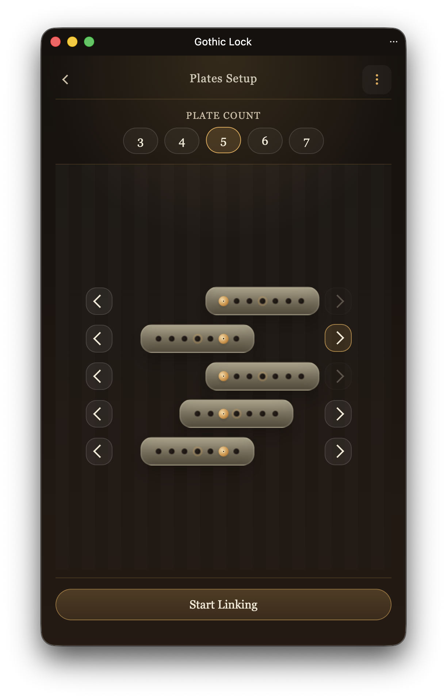

# Gothic Lock

[Open the app on GitHub Pages](https://rychorus.github.io/gothiclock/)

Gothic Lock is a small app for solving Gothic Remake locks, including chests and doors.

It guides you from setup through linking and solution playback. All input is diagram-based, so you work from the lock layout instead of typing values by hand.

## What It Does

- Guides you through setting up plates, linking them, and building the solution sequence.
- Lets you save locks locally in the browser.
- Exports shareable links that restore a solved state.
- Includes a Windows PowerShell helper that can auto-type the solution for you.
- Can be installed as a PWA.

## Screenshots

| Main Menu | Plates Setup | Linking | Solution |
| --- | --- | --- | --- |
|  |  |  |  |