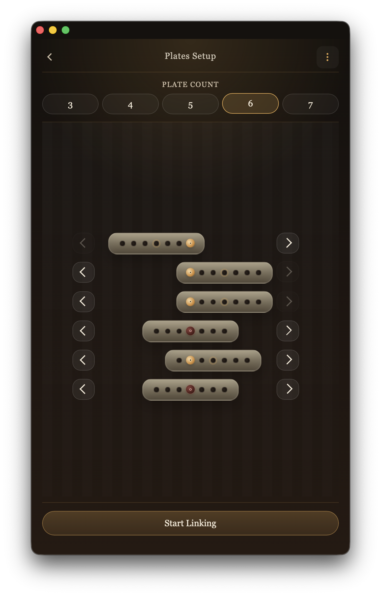
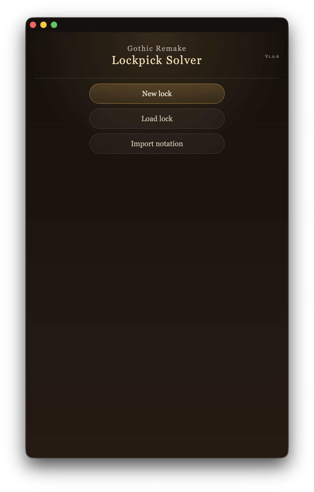
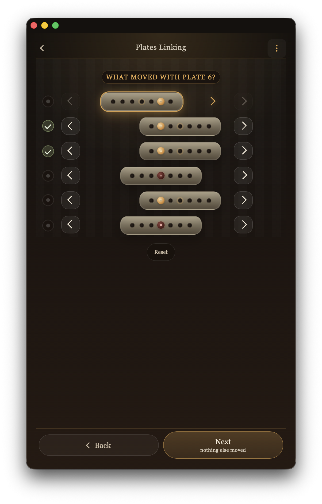
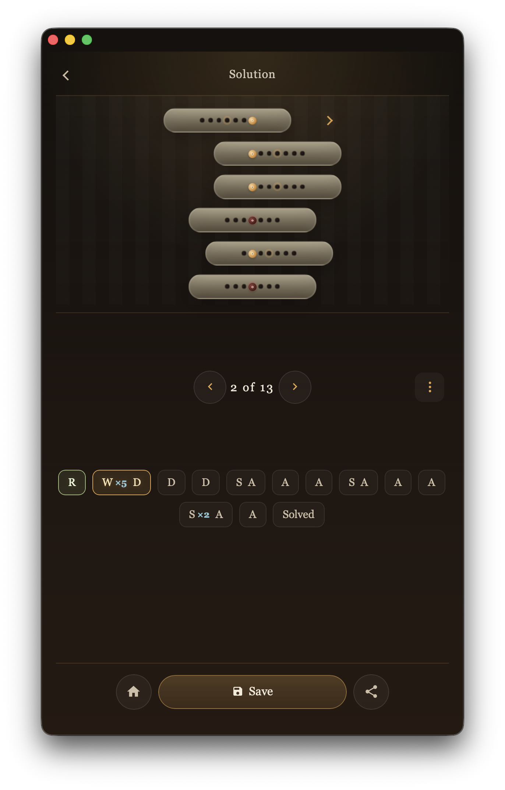

# Gothic Lock

[Open the app on GitHub Pages](https://rychorus.github.io/gothiclock/)

Gothic Lock is a small app for solving Gothic Remake locks, including chests and doors.

It guides you from setup through linking and solution playback. All input is diagram-based, so you work from the lock layout instead of typing values by hand.

## What It Does

- Guides you through setting up plates, linking them, and applying the solution sequence
- Lets you save locks locally in the browser
- Share your solution as a URL
- Includes a Windows PowerShell helper that can automatically "type" the solution for you in-game
- Can be installed as a PWA.

## Screenshots

| **Main Menu**  | **Plates Setup**  |
| --- | --- |
| **Linking**  | **Solution**  |
